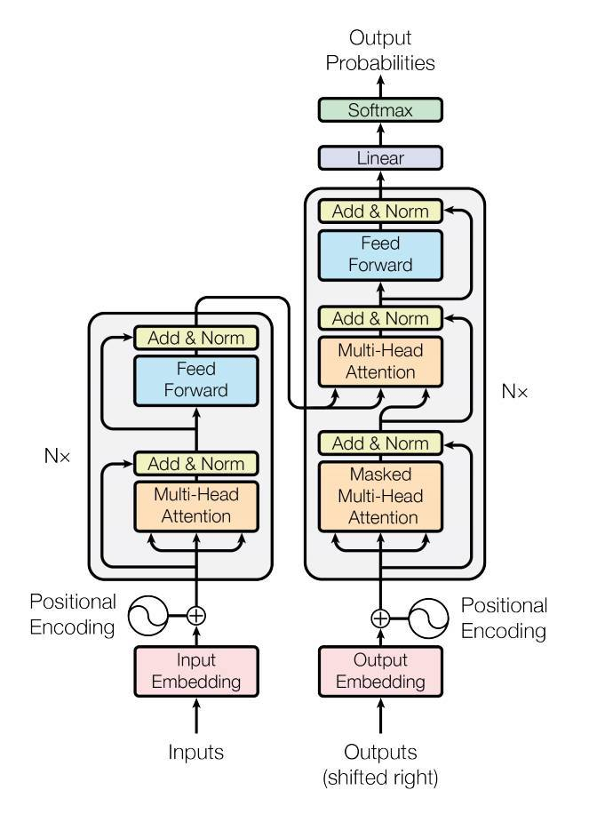

# cls-vs-mean-pooling-transformer-classification
이 프로젝트는 transformer모델에서 <b>cls와 mean_pooling 방식으로 분류</b> 작업을 하고, 두 개가 어떤 특징을 가지고 있는지, 비교 분석하는 프로젝트입니다.

# 1. Concept Overview
Classification using Transformers can be broadly divided into two main categories:

1. **Classification using the `<CLS>` token**
2. **Classification using `mean_pooling`**

## 1.1 The `<CLS>` Token Method

In the **`<CLS>` method**, a special `<CLS>` token is inserted at the beginning of a sentence. Through the **self-attention** mechanism, the `<CLS>` token captures the contextual information of the entire sequence. This token's final representation is then used to classify the sentence.

      cls_vector = x[:, 0, :]
      return self.linear(cls_vector)

## 1.2 Mean pooling
**Mean pooling** is a method where the sentence is classified using a vector derived by calculating the **arithmetic mean of the row vectors** (token embeddings) from the final output of the encoder.

      x = x * mask.unsqueeze(-1).float()
      x = x.sum(dim=1)
      count_x = mask.sum(dim=-1).unsqueeze(-1).float()
      x = x / count_x
      return self.linear(x)

# 2. Dataset: AGNews
**AGNews (AG's News Corpus)** is a widely used benchmark dataset for text classification tasks. It consists of news articles gathered from more than 2,000 news sources.

## 2.1 Overview
The dataset is specifically designed for **topic classification**, where models must categorize news articles into one of four distinct classes. Each sample contains a **Title** and a **Description** of the article.

### 2.1.1 Dataset Statistics
* **Total Classes**: 4
* **Training Samples**: 120,000 (30,000 per class)
* **Testing Samples**: 7,600 (1,900 per class)
* **Data Format**: CSV (Class Index, Title, Description)

### 2.1.2 Class Labels
The articles are categorized into the following four topics:
1.  **World** (Index 1)
2.  **Sports** (Index 2)
3.  **Business** (Index 3)
4.  **Sci/Tech** (Index 4)

### 2.1.3 Task Goal
The goal is to train a model to accurately predict the class index ($y \in \{1, 2, 3, 4\}$) based on the input text ($x$), which is typically the concatenation of the title and description.

## 2.2 Data Preprocessing

### 2.2.1 Creation of 'full text' and 'Class' Columns
The original CSV file consists of `Class Index`, `Title`, and `Description`.
* **Class Column:** Since the `Class Index` values range from 1 to 4, we subtract 1 from each value to map them to a **0 to 3** range for model compatibility.
* **Full Text:** For the classification task, the `Title` and `Description` are concatenated into a single field named **full text**.

### 2.2.2 Conversion to .txt Format
In this project, we use **SentencePiece** as our tokenizer.
Since SentencePiece requires raw text files for training or processing, the CSV data is converted into a **.txt** format.

### 2.2.3 Training, Validation, and Test Sets
The dataset is divided into three parts:
1. **Test Set:** Pre-separated in the original dataset.
2. **Training & Validation Sets:** The original training data was split into training and validation sets with a **validation ratio of 0.2** (80/20 split).

# 3. Model

The model was implemented from scratch, following the Encoder structure of the Transformer. The layers consist of:

1. **Positional Encoding**
2. **Multi-head Attention**
3. **Add & Norm**
4. **Feed Forward**
5. **Add & Norm**

All models used in this project follow this exact architecture, with the only differences being the hyperparameters.

## 3.1 Base Model

# 4. Tokenizer

# 5. performance of models